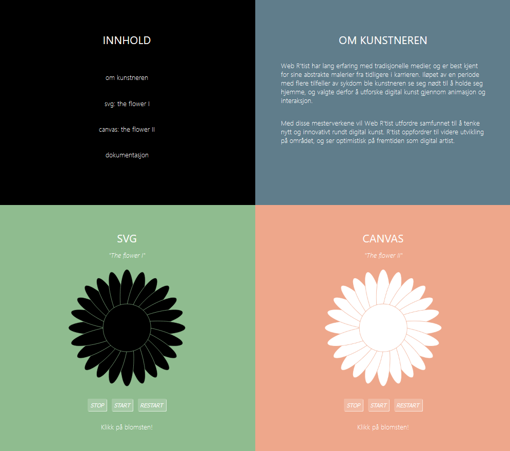
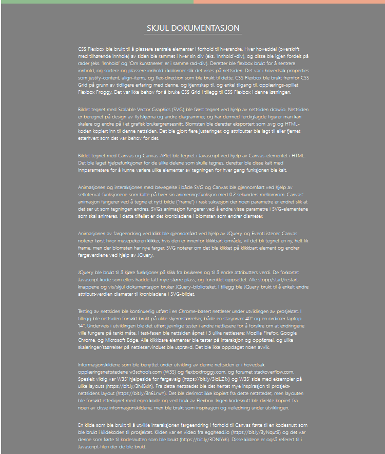

# Project 1 - Canvas and SVG

This project demanded the use of basic JavaScript, HTML and CSS knowlwdge, including the Canvas, SVG and JQuery libraries.

An extensive documentation of tools and sources is included on the website.

 

