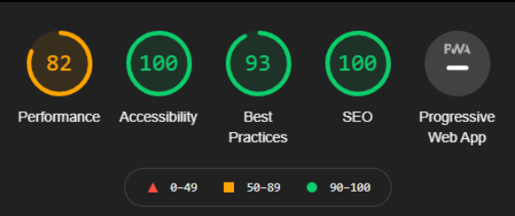
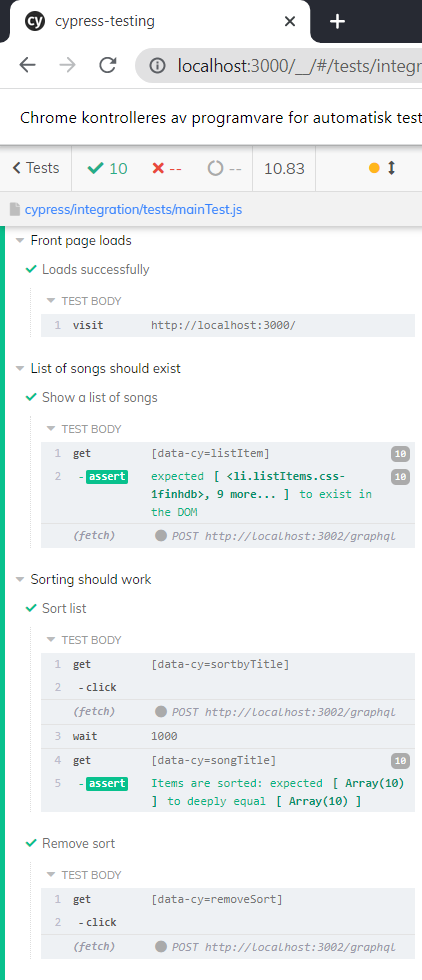

# Kjøring av appen

Appen finnes på [http://it2810-30.idi.ntnu.no/prosjekt3/](http://it2810-30.idi.ntnu.no/)

Bruk NTNU VPN dersom du ikke er koblet til NTNU sitt nett.

## Start

1. Åpne IDE på plassering der du ønsker å jobbe lokalt
2. Klon repository fra gitlab
3. Flytt deg inn i mappen backend: cd backend
4. I mappen "/prosjekt\_3/backend" kjør: npm install
5. I mappen "/prosjekt\_3/backend" kjør: npm start
6. Flytt deg inn i mappen frontend: cd frontend
7. I mappen "/prosjekt\_3/frontend" kjør: npm install
8. I mappen "/prosjekt\_3/frontend" kjør: npm start

For å kjøre enhetstester, i frontend: 
1. kjør npm test

For å kjøre end2end testing: 
1. cd cypress-testing
2. npm install cypress
3. npx cypress verify
4. npx cypress open

Inne i cypress (eget vindu) velg mainTest.js og kjør den.

**_--NB! Til deg som skal teste/vurdere nettsiden:_ Det er mulig å slette data permanent fra databasen, men la det være igjen tilstrekkelig data til nestemann. Evt. legg til mer data hvis det er nødvendig.--** 

 

# Dokumentasjon

## Teknologi

### React, Typescript, MongoDB, Node.js, GraphQL, Chakra-UI, Apollo Client, Express.js, Mongoose, Cypress : (MERN++)

Løsningen er laget med create-react-app og skrevet i Typescript. Redux er brukt til state management for å lagre SearchTerm (input fra brukeren i søkefeltet) og SortTerm (input fra brukeren via sorteringsknappene).

Vi har brukt GraphQL, Mongoose &amp; Apollo Client, og har satt opp databaseserveren ved hjelp av MongoDB &amp; Express.js. I tillegg har vi brukt Node.js, og Chakra-UI-biblioteket for å utvikle frontend. Cypress er brukt til å automatisere end-2-end testing.

Begrunnelse for valg: Vi har valgt å benytte MERN-stacken fordi den er godt dokumentert. Underveis i utviklingen av prosjektet la vi til Apollo Client i stacken etter råd fra studass på sal.

 

## Innhold og funksjonalitet

### Søkemulighet, filtrering og sortering

Løsningen inneholder et input-felt der brukeren kan søke i databasen på sang, album eller artist og resultatsettet vil vises som en liste. Listen kan utvides ved å trykke på &quot;Show more&quot;-knappen, da vil 10 nye elementer lastes inn (eller færre hvis søket avgrenser resultatet). Brukeren får også muligheten til å redusere listen til de 10 første elementene med &quot;Show less&quot;-knappen. Det er 5 måter å sortere listen på: sang-tittel, sang-lengde, album-tittel, år utgitt, og artist-navn. Bruker kan også fjerne sorteringen og få frem den originale listen (med evt. filtrert søk).

### Detaljert visning av objekt (ViewSong) og sletting av objekt

Hvert element i listen har en knapp &quot;View song&quot; der et vindu med mer detaljert informasjon om sangen vises. I dette vinduet har brukeren også muligheten til å slette sangen fra databasen (permanent endring).

### Brukergenerert data (AddSong)

Løsningen gjør det mulig for bruker å legge til en sang i databasen ved hjelp av input-skjema. Bruker må legge til sang-tittel, sang-lengde, album-tittel, år utgitt, og minst én artist, med mulighet til å legge til to artister (men dette er ikke nødvendig).

### Responsivt design og universell utforming

Vi har tatt i bruk Chakra-UI for å utvikle og designe frontend. Siden er responsiv og funksjonell i ulike nettlesere, på ulike skjermstørrelser, og ulike enheter. Vi har utført noen få brukertester for å teste designvalg og layouten på siden, og er fornøyd med at alle brukerne fant fram til det de ville og at valgene av side-elementer var gode.

For å tilpasse nettsiden til alle brukere har vi sørget for å følge retningslinjer for universell utforming. Dette innebærer bl.a. labels til input, navngivning på ulike HTML-elementer, gode kontraster, og at man kan tabbe gjennom de funksjonelle elementene på siden. Ved kjøring av Lighthouse på nettsiden (gjennom inspect-modulen i nettleseren, i incognito-mode for å få vekk unødvendige extensions som kan følge med nettleseren) får vi dette resultatet:

(Vi får dessverre en Performance-score vi ikke kan gjøre noe med fordi den slår ut på unødvendig og ubrukt JavaScript som følger med installeringsfilene til flere av komponentene og bibliotekene vi har brukt. I tillegg har vi en warning i console som slår ut på at liste-elementene ikke har ulike keys, selv om vi har gitt alle elementene egne keys.)

### VM og database

Under utviklingen av løsningen lagde vi en database med 96 elementer for å ha tilstrekkelig data å jobbe med. Denne er lastet opp på VMen i sin helhet.

**_-- NB! Til deg som skal teste/vurdere nettsiden:_ Det er mulig å slette data permanent fra databasen, men la det være igjen tilstrekkelig data til nestemann. Evt. legg til mer data hvis det er nødvendig.--**

 

## Testing

### End-2-end testing med Cypress

Vi tester ulike brukerscenarioer gjennom automatisert end-2-end testing, og til dette bruker vi Cypress. For å kjøre Cypress-testingen må man først cd inn i mappen som heter cypress-testing. Deretter må man kjøre npm i cypress. Etter man har installer Cypress kjører man npx cypress verify, så npx cypress open og kjører filen “mainTest.js”.

Test-scenarioet består av at nettsiden laster inn, om lista eksisterer, å legge til en sang, søk i databasen, sortering på tittel og fjerning av sortering, ulik presentering av listen (utvide og korte ned visning av listen), se detaljer om sang og fjerning av sang. Det som blir sjekket er om lista eksisterer, om en sang man har lagt til eksisterer i listen, om sorteringen funker og om pagination funker. Det er brukt “data-cy” for å velge elementer. Det er fordi dette er best practice når det kommer til Cypress-testing. Denne type testing kjøres isolert fra endringer.

### Enhetstesting og snapshot-testing

Det er gjennomført testing av redux, interaksjon med elementer, at databasen laster verdier som forventet og tester at alle komponentene laster. Vi gjennomfører snapshot testing av alle komponentene, for å sjekke om ny lasting av siden vil gi endringer i forhold til snapshoten av forventet utseende. På grunn av det eksterne biblioteket Chakra UI, så legges det id på alle labels. Dette genererer unike id-verdier for disse elemente, som da er ulike for hver gang siden lastes, og dermed vil det gir snapshot feil, selv om det ikke er noen endring i utseende. Alle tester godkjennes ellers.

### Dokumentasjon

Løsningen er dokumentert med denne README.md-fila og via kommentarer i koden, som skal gjøre det lettere for en ekstern å forstå innholdet.

### Kilder og hjelpsomme nettsteder

Web accessibility:

- [https://www.w3.org/WAI/tips/developing/](https://www.w3.org/WAI/tips/developing/)

- [https://www.w3.org/WAI/test-evaluate/preliminary/](https://www.w3.org/WAI/test-evaluate/preliminary/)

ChakraUI:

- [https://chakra-ui.com/docs/getting-started](https://chakra-ui.com/docs/getting-started)

Apollo:
- [Offesiell dokumentasjon for testing av Apollo Client](https://www.apollographql.com/docs/react/development-testing/testing/)
- [https://www.apollographql.com/docs/react/data/mutations/](https://www.apollographql.com/docs/react/data/mutations/)

- [https://stackoverflow.com/questions/62652375/updating-multiple-values-in-graphql-apollo-mutation](https://stackoverflow.com/questions/62652375/updating-multiple-values-in-graphql-apollo-mutation)

Redux:
- [Offsiell dokumentasjon for redux](https://redux.js.org/)

Cypress:
- [https://docs.cypress.io/guides/references/best-practices](https://docs.cypress.io/guides/references/best-practices)

- [https://www.youtube.com/watch?v=OIAzwr-_jhY](https://www.youtube.com/watch?v=OIAzwr-_jhY)

Backend
- [https://github.com/academind/yt-graphql-react-event-booking-api/tree/master](https://github.com/academind/yt-graphql-react-event-booking-api/tree/master)