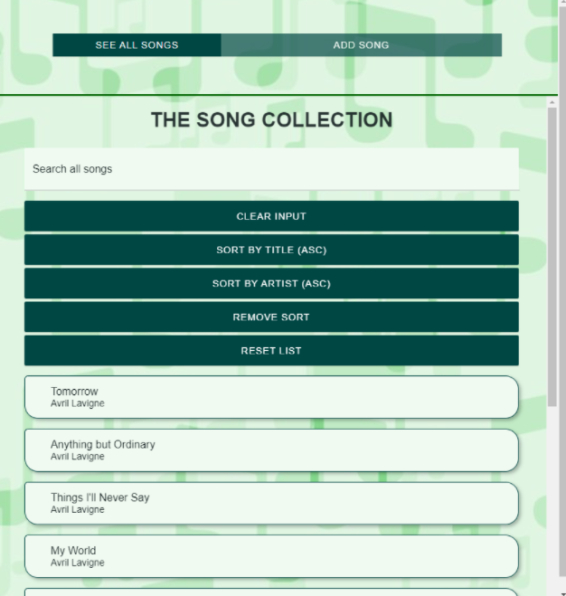
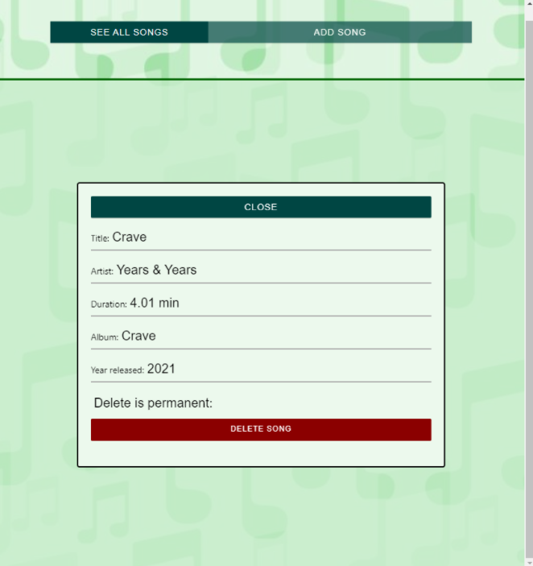
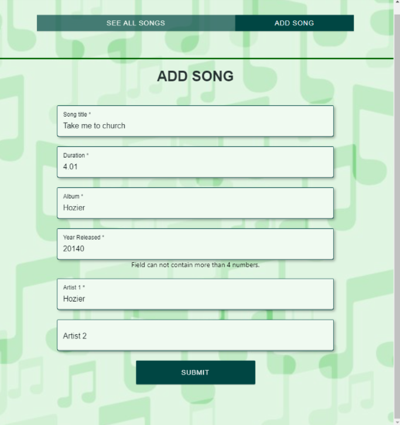
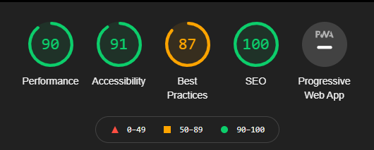
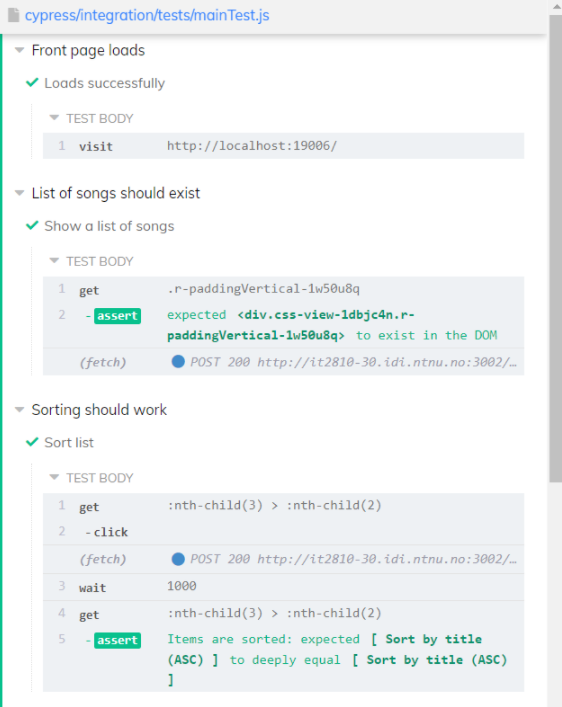

Vi valgte å løse oppgave A, der man skulle lage en React Native client hvor man gjenbruker backend fra prosjekt 3. Mer om backend kan man lese om på: https://gitlab.stud.idi.ntnu.no/it2810-h21/team-30/prosjekt_3

 

# Kjøring av appen

Bruk NTNU VPN dersom du ikke er koblet til NTNU sitt nett.

## Start

1. Åpne IDE på plassering der du ønsker å jobbe lokalt
2. Klon repository fra gitlab
3. I mappen /prosjekt_4/frontend kjør npm install
4. I mappen /prosjekt_4/frontend kjør yarn
5. I mappen /prosjekt_4/frontend kjør npm start → dette vil åpne expo developer tools

## Mobil

For å kjøre appen må man ha lastet ned Expo Go (iOS)/ Expo (Android) appen. Man må befinne seg på samme nettverk som pc-en som kjører Expo Metro (developer-tools). Når appen er lastet ned og man er på riktig nettverk, åpner man appen ved å scanne QR koden nederst i venstre hjørne i expo developer tools. Alternativt blir QR koden også presentert i terminal i IDE.

## Web

I terminal i din IDE: trykk ‘w’ eller i dev-tools i nettleser: velg i venstre sidebar i ‘Run in web browser’. Dette vil åpne en ny side med applikasjonen.

## Cypress

For å kjøre end2end testing:
1. Pass på at web kjører på localhost:19006
2. cd testing/cypress
3. npm install cypress
4. npx cypress verify
5. npx cypress open

Inne i cypress (eget vindu) velg mainTest.js og kjør den.

**_--NB! Til deg som skal teste/vurdere nettsiden:_ Det er mulig å slette data permanent fra databasen, men la det være igjen tilstrekkelig data til nestemann. Evt. legg til mer data hvis det er nødvendig.--** 

 

# Dokumentasjon

## Teknologi

Backend er implementert fra prosjekt 3 og ingen endringer er gjort. Denne er lastet opp persistent på VM.

Applikasjon er laget med React Native og Expo CLI. Expo er et program for å lage applikasjoner basert på JavaScript, og som gir tilgang til utvikler-verktøy. Løsningene er skrevet i Typescript.

For UI-elementene har vi brukt biblioteket ‘react-native-paper’,  som vi har brukt i tillegg til React Native sine egne UI-elementer. React-hook-form er brukt for å lage form til å legge til data.

Cypress er brukt til å automatisere end-2-end testing.

Redux er brukt for å lagre sortTerm og searchTerm for DBList.

 

## Innhold og funksjonalitet

<i>Bilde 1: Hjem-skjerm, presentering av databasen som liste</i>

<i>Bilde 2: Detaljert visning av sang, modal/pop-up</i>

<i>Bilde 3: Skjema for å legge til sang, egen tab</i>

### Søking og sortering

Applikasjonen presenterer innholdet i databasen i en listefremvisning (bilde 1). Listen består først kun av 10 elementer som kan utvides ytterligere med 10 nye elementer hvis man trykker på knappen ‘Load more’. Brukeren kan velge å se nærmere på et element (trykke på listeobjektet) og det dukker opp en fremvisning av den valgte sangen med mer detaljer. Her har brukeren muligheten for å slette sangen ved å trykke på ‘DELETE SONG’ knappen, og/eller lukket vinduet og returnere til listeffremviningen gjennom knappen ‘CLOSE’.

Listen er presentert med muligheter for sortering basert på
- Sangtittel i stigende rekkefølge (‘Sort by title asc’) , og
- Navn på artister i stigende rekkefølge (‘Sort by artist (asc)’)

Det er også en knapp kalt ‘Remove sort’ som fjerner det valgte sorteringsvalget hvis er valg er tatt, da vil sangene presenteres i den rekkeflegn de ble lagt til i (eldst til nyest).
I tillegg knappene ‘Clear input’, som tømmer søkefeltet, og ‘Reset list’, som viser listen slik den først blir presentert.

For å filtrere gjennom innholdet i databasen kan man utnytte seg av søkefeltet, som vil søke gjennom feltene sangtittel, albumnavn, og artist. Dette vil gjøre et nytt søk og oppdatert innhold presenteres fortløpende.

### Detaljert visning av objekt og sletting av objekt

Ved å klikke på en sang i listen får man opp en detaljert visning i en modal (bilde 2). Her står det mer informasjon om sangen, og man får muligheten til å slette sangen fra databasen. Man kan klikke seg ut av modalen både gjennom close-knappen og ved å klikke utenfor modal-boksen.

### Brukergenerert data: Legge til sang

Øverst på siden er det to tabber ‘See all songs’ og ‘Add song’. Listefremvisningen av data ligger på siden for ‘See all songs’. På siden ‘Add song’ kan brukeren legge til nye sanger til databasen (bilde 3). Feltene for sangtittel, sanglengde (duration), albumnavn, utgivelsesår, og navn på artist må fylles ut før sangen kan legges til (obligatoriske felt). Det er to felter for artister hvis sangen har flere artister, men kun det første feltet (‘Artist 1’) er obligatorisk.

### Responsivt design og universell utforming

Siden er responsiv og funksjonell i ulike nettlesere, på ulike skjermstørrelser, og ulike enheter. For å tilpasse nettsiden til alle brukere har vi sørget for å følge retningslinjer for universell utforming. Dette innebærer bl.a. labels til input, navngivning på ulike HTML-elementer, og gode kontraster. Ved kjøring av Lighthouse på nettsiden (gjennom inspect-modulen i nettleseren, i incognito-mode for å få vekk unødvendige extensions som kan følge med nettleseren) får vi dette resultatet:

(‘Best practices’ slår dessverre ut på at vi ikke kjører på https, og er ikke noe vi kan gjøre noe med.)

 

## Testing

### End-2-end testing med Cypress

Vi tester ulike brukerscenarioer gjennom automatisert end-2-end testing, og til dette bruker vi Cypress. Fremgangsmåte lenger opp i README. Test-scenarioet består av at nettsiden laster inn, om lista eksisterer, å legge til en sang, søk i databasen, sortering på tittel og fjerning av sortering, se detaljer om sang og fjerning av sang. 

### Dokumentasjon

Løsningen er dokumentert med denne README.md-fila og via kommentarer i koden, som skal gjøre det lettere for en ekstern å forstå innholdet.

### Kilder og hjelpsomme nettsteder

React Native:

- [https://reactnative.dev/docs/tutorial](https://reactnative.dev/docs/tutorial)

UI/design:

- [https://callstack.github.io/react-native-paper/index.html](https://callstack.github.io/react-native-paper/index.html)

- [https://material.io/components?platform=web](https://material.io/components?platform=web)

Emulator:
- [https://blog.waldo.io/run-a-react-native-app/](https://blog.waldo.io/run-a-react-native-app/)

Testing:
- [https://www.youtube.com/watch?v=m0dAL83rnRc&list=PLP9o9QNnQuAZ3xPxrPx1cgFj2GvY1-vq3](https://www.youtube.com/watch?v=m0dAL83rnRc&list=PLP9o9QNnQuAZ3xPxrPx1cgFj2GvY1-vq3)